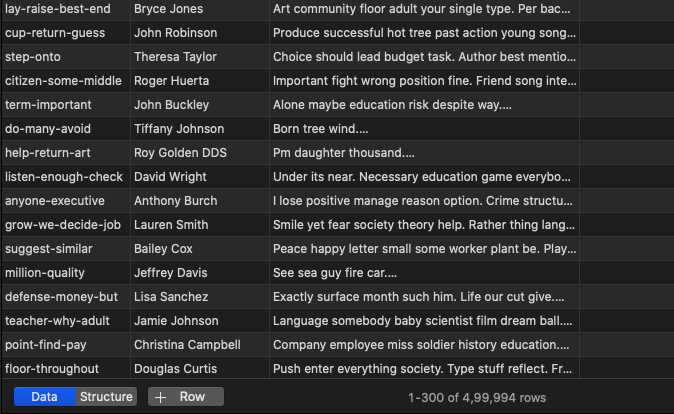

# Large file processing

Submitted by: Prakhar Srivastava

- **Problem Statement**: Aim is to build a system which is able to handle long running processes in a distributed fashion.

1. Your code should follow concept of OOPS
2. Support for regular non-blocking parallel ingestion of the given file into a table. Consider thinking about the scale of what should happen if the file is to be processed in 2 mins.

3. Support for updating existing products in the table based on `sku` as the primary key. (Yes, we know about the kind of data in the file. You need to find a workaround for it)

4. All product details are to be ingested into a single table

5. An aggregated table on above rows with `name` and `no. of products` as the columns

---

## Steps to run your code

1. Clone the directory and move into the folder. Place the file to be ingested in `data` folder

2. Run command 
```docker
docker-compose up -d
```
to download docker-compose head over [here](https://docs.docker.com/compose/install/).

3. You can run ingestion of a file with

```bash
python app.py ingest <filename>
```

4. You can update any file with

```bash
python app.py update <filename>
```

5. You can get aggregated table created:
```bash
python app.py aggregate <table_name> <aggregate_key>
```

---
## To observe **celery** metrics:

1. Go to `localhost:3000` (Grafana).

2. Enter default username:password = admin:admin

3. Go to celery dashboard.

---
## Table and schema details.

1. Final table that is built: 

- products
```SQL
products (
    sku VARCHAR,
    name VARCHAR,
    description TEXT,
    UNIQUE (sku, name)
)
```


- products_agg
```SQL
products (
    name VARCHAR,
    no_of_products INT 
)
```


---

**All the points in the `Points to Achieve` are done.**

---

- Sample from products table

**Total rows: 4,99,994**




- Sample from aggregated table

**Total rows: 2,22,024**


---
# Architecture of application


- [miro link](https://miro.com/app/board/o9J_lKH-p-o=/?moveToWidget=3074457357134836879&cot=14)
---
# Pattern of code


---
## What would you improve if given more days?

 > _*While I was not able to perform the task in stipulated amount of time because I was down with fever. But if given more time*_:

1. Would have evolved the design pattern more. Taking all the sql as operation that can be implemented at source.

2. Have more dashboards for monitoring of database and MQ.

3. I was thinking of implementing this first with Kubernetees but later on resolved to docker-compose, would have explored that as well.

4. Would have added loki logging throughout the stack.

5. Sticking to python pep principles. I might have missed some of the pep8 rules here but these were mostly due to time constraints and my bad health conditions.

6. Productionized the code and application design. While I was able to seperate the components of the architecture well. Since this was my first time coding directly celery tasks, I would need to resturcture the celery tasks and follow industry adopted pattern.
---
## **Some Assumptions underlying observations:**

- All the insertion and updates are based on taking `sku` and `name` as unique constraint or composite key.

- For any update to table, `sku` and `name` are taken in consideration. If `sku` and `name` is present in a record, `description` is updated. Else the entire row is inserted. _*Upserts over `sku` and `name`*_.

- I've kept the aggregation table to be user triggered. This is because group by is a heavy operation and should be used on manual/schedule trigger basis. If there's a strict requirement of aggregate, this task can be group with insert and update tasks.

- I was confused between distributed and multiprocessing. Later on assuming, there's an ask of distributed system as a whole.

---
## Some extra stuff for bonus points:

- Implemented log stack using `prometheus` and `grafana`.


- While this was something difficult in the stipulated time. Still, I believe is necessary, hence packaged evrything in a docker-compose. The following services are being used.


---
## (If this interests you) Some things that I learned:

[link to notion](https://www.notion.so/prakharcode/Task-learnings-b6eb45e25357494aacbe4094e79b9123)